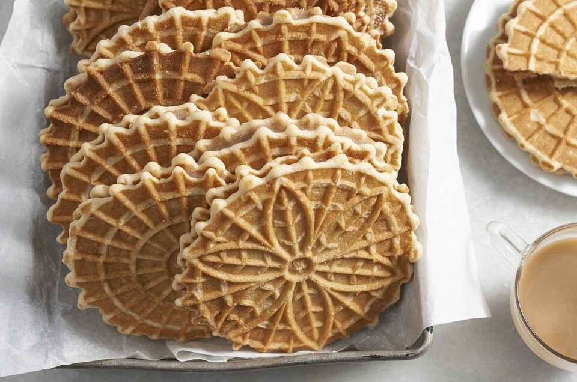

[Back to Main Page](README.md)



## Holland Cultural Highlights

### Dutch Cuisine
Dutch cuisine features a variety of hearty dishes. Some popular items include:
```
Stroopwafels: Thin waffle cookies filled with caramel syrup.

Bitterballen: Deep-fried balls filled with a mixture of beef or veal.

Haring: Raw herring fish often served with onions and pickles.
``` 
### Rijksmuseum

> The **Rijksmuseum** in Amsterdam is a national museum dedicated to arts and history. It houses an extensive collection of Dutch Golden Age paintings, including works by Rembrandt and Vermeer.

### Anne Frank House

The **Anne Frank House** is a museum dedicated to Jewish wartime diarist Anne Frank. Visitors can explore the hidden annex where Anne and her family hid during World War II.

### Cycling

The Netherlands is known for its extensive cycling infrastructure, and cycling is a popular mode of transportation.
[^1]

[^1]: With dedicated bike lanes and bike-friendly cities, it's a great way to explore the country!
