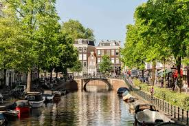

# The Netherlands

The Netherlands, often referred to as Holland, is a country that I visited with my family when I was a young kid, so I wanted to share some details about it for this assignment. It is known for its flat landscape, extensive canal systems, windmills, tulip fields, and cycling routes.

## Table of Contents
1. [Geography](#geography)
2. [Culture](#culture)
3. [Language](#language)
4. [Transportation](#transportation)

## Geography
The Netherlands is a low-lying country with approximately a third of its land below sea level. It is famous for its polders, reclaimed land enclosed by dikes. The country is crisscrossed by rivers and canals, and a significant portion of its land area is devoted to agriculture.

## Culture
Dutch culture is known for its tolerance, liberalism, and emphasis on individual freedom. The country has a rich artistic tradition, with famous painters like Rembrandt and Van Gogh hailing from the Netherlands. Dutch festivals, such as King's Day (Koningsdag), showcase the lively and festive nature of the Dutch people. More information on Holland's culture can be found [Here](HOLLAND.md).

## Language
The official language of the Netherlands is Dutch. English is widely spoken, making it easy for tourists to navigate and communicate.

## Transportation
The Netherlands has a well-developed and efficient transportation system. Key elements include:
- **Cycling:** The country is known for its extensive network of cycling paths.
- **Trains:** A reliable and widespread train network connects major cities and towns.
- **Canals:** In cities like Amsterdam, canals are not just scenic but also serve as a means of transportation.

*Whether you're exploring the vibrant cities, enjoying the picturesque countryside, or indulging in Dutch cuisine, the Netherlands offers a diverse and enriching experience for every traveler.*
